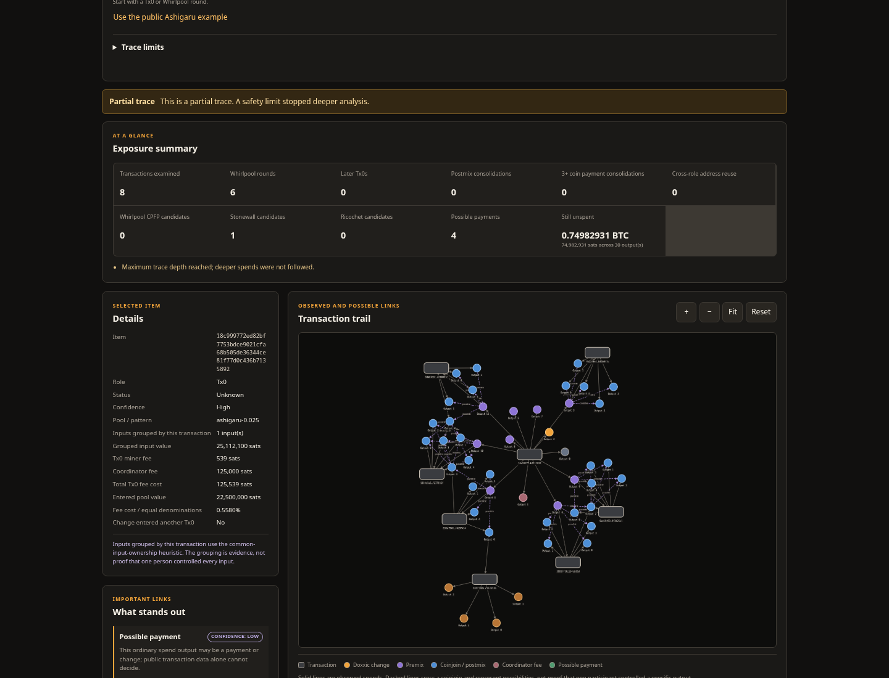

# dewhirlpooler

[](https://github.com/clenchwallet/dewhirlpooler/actions/workflows/ci.yml)

Read-only Bitcoin transaction analysis for possible Whirlpool exposure.
DeWhirlpooler uses Fulcrum/Electrum for interactive traces and optional Bitcoin
Core block RPC for its historical index.

It provides:

- evidence-labelled Tx0, premix, Whirlpool-round, and doxxic-change detection;
- exact Tx0 accounting and 5:5 through 8:8 entrant/remixer metrics;
- bounded Stonewall, Ricochet, CPFP, address-reuse, postmix-consolidation, and
  Payjoin/Cahoots fingerprint signals;
- a resumable, reorg-safe coordinator and pool-liquidity index;
- CLI and HTTP interfaces plus a local Cytoscape graph; and
- an optional SQLite report cache and non-root Docker deployment.

## Quick start

Python 3.12+:

```bash
python3 -m venv .venv
.venv/bin/pip install -e '.[test]'

export DEWHIRLPOOLER_FULCRUM_HOST='<host>'
export DEWHIRLPOOLER_FULCRUM_PORT='50001'

.venv/bin/uvicorn dewhirlpooler.web:create_app \
  --factory --host 127.0.0.1 --port 8000
```

Open `http://127.0.0.1:8000`.

Docker:

```bash
cp .env.example .env
# Set DEWHIRLPOOLER_FULCRUM_HOST in .env
docker compose up --detach --build
```

Compose publishes `127.0.0.1:8000` by default. The web server has no
authentication.

## Configuration

| Variable | Default | Purpose |
| --- | --- | --- |
| `DEWHIRLPOOLER_FULCRUM_HOST` | required | Fulcrum/Electrum host |
| `DEWHIRLPOOLER_FULCRUM_PORT` | `50001` or `50002` | Plain or TLS port |
| `DEWHIRLPOOLER_FULCRUM_TLS` | `false` | Enable Fulcrum TLS |
| `DEWHIRLPOOLER_FULCRUM_TIMEOUT` | `10` | Request timeout in seconds |
| `DEWHIRLPOOLER_CACHE_PATH` | disabled | SQLite report cache |
| `DEWHIRLPOOLER_CACHE_TTL_SECONDS` | `900` | Report TTL |
| `DEWHIRLPOOLER_CACHE_MAX_ENTRIES` | `256` | Maximum cached reports |
| `DEWHIRLPOOLER_CORE_HOST` | unset | Bitcoin Core RPC host |
| `DEWHIRLPOOLER_CORE_PORT` | `8332` | Bitcoin Core RPC port |
| `DEWHIRLPOOLER_CORE_USER` | unset | Bitcoin Core RPC user |
| `DEWHIRLPOOLER_CORE_PASSWORD` | unset | Bitcoin Core RPC password |
| `DEWHIRLPOOLER_CORE_TLS` | `false` | Enable Core RPC TLS |
| `DEWHIRLPOOLER_CORE_TIMEOUT` | `30` | Core RPC timeout in seconds |
| `DEWHIRLPOOLER_CHAIN_DB` | unset | Historical-index SQLite file |
| `DEWHIRLPOOLER_CHAIN_START_HEIGHT` | `550000` | First indexed block |
| `DEWHIRLPOOLER_CHAIN_BUSY_TIMEOUT_MS` | `5000` | SQLite busy timeout |
| `DEWHIRLPOOLER_CHAIN_PREFETCH_WORKERS` | `8` | Concurrent block fetches, `1`–`16` |

Core-backed commands require Bitcoin Core 28+, an unpruned scan range, and
verbosity-3 access to `getblockcount`, `getblockhash`, and `getblock`.
Fulcrum/Core credentials are read from the process environment and are not
included in report responses.

## CLI

```bash
# Fulcrum health and optional transaction lookup
dewhirlpooler probe
dewhirlpooler probe --txid '<txid>'

# Core health and verbosity-3 block validation
dewhirlpooler core-probe
dewhirlpooler core-probe --height 577604

# One transaction plus resolved prevouts
dewhirlpooler inspect --txid '<txid>'

# Bounded exposure graph/report
dewhirlpooler trace --txid '<txid>'
dewhirlpooler trace --txid '<txid>' --json

# Historical index
dewhirlpooler chain-index
dewhirlpooler chain-status
```

Trace defaults:

- depth: `8`
- transactions: `100`
- outputs: `250`
- script-history lookups: `250`

Override them with `--max-depth`, `--max-transactions`, `--max-outputs`, and
`--max-history-lookups`.

`chain-index` commits one block atomically and resumes from the indexed tip.
The configured start height is persisted in the database. The web process
opens `DEWHIRLPOOLER_CHAIN_DB` read-only and does not require Core credentials.

## HTTP API

Trace:

```bash
curl \
  --request POST \
  --header 'Content-Type: application/json' \
  --data '{
    "txid": "<txid>",
    "max_depth": 8,
    "max_transactions": 100,
    "max_outputs": 250,
    "max_history_lookups": 250
  }' \
  http://127.0.0.1:8000/api/trace
```

Historical index:

```bash
curl http://127.0.0.1:8000/api/network
curl \
  'http://127.0.0.1:8000/api/network/pools/ashigaru-0.025/history?limit=12'
```

The history endpoint accepts `start_height` and `end_height`, returns rows in
ascending height order, and caps responses at 2,000 rows.

Report-cache status is returned in `X-DeWhirlpooler-Cache`:

- `HIT`: cached report;
- `MISS`: live analysis stored successfully;
- `BYPASS`: cache disabled or unavailable.

## Analysis boundary

Amounts, scripts, fees, block metadata, and direct spends are observed chain
data. Tx0, Whirlpool, postmix classifications, address roles, Payjoin/Cahoots,
and links across a coinjoin are heuristics. A truncated trace or partial index
reports its coverage limits.

Coordinator profit is reported as a conservative range when a consolidation
combines tracked coordinator outputs with untracked inputs. The profit upper
bound assigns only the fee that cannot be covered by untracked inputs; the
profit lower bound assigns the full mining fee because those untracked inputs
may share coordinator ownership. Fully tracked consolidation fees remain
exact, and a conservative lower bound can be negative.

All browser assets are packaged locally; the application UI makes no CDN,
analytics, telemetry, font, or other third-party browser requests.

## Public example

[](docs/public-example.md)

The [public example](docs/public-example.md) uses transaction
`18c999772ed82bf7753bdce9021cfa68b505de36344ce81f77d0c436b7135892`
with fixed trace limits.

## Development

```bash
.venv/bin/pytest -q
.venv/bin/ruff check . --select E,F,I,UP
.venv/bin/python -m compileall -q src tests
node --check src/dewhirlpooler/static/app.js
```

See [Docker deployment](docs/deployment.md) and
[behavioral sources and fixture provenance](docs/sources.md).

## License

[MIT License](LICENSE)
